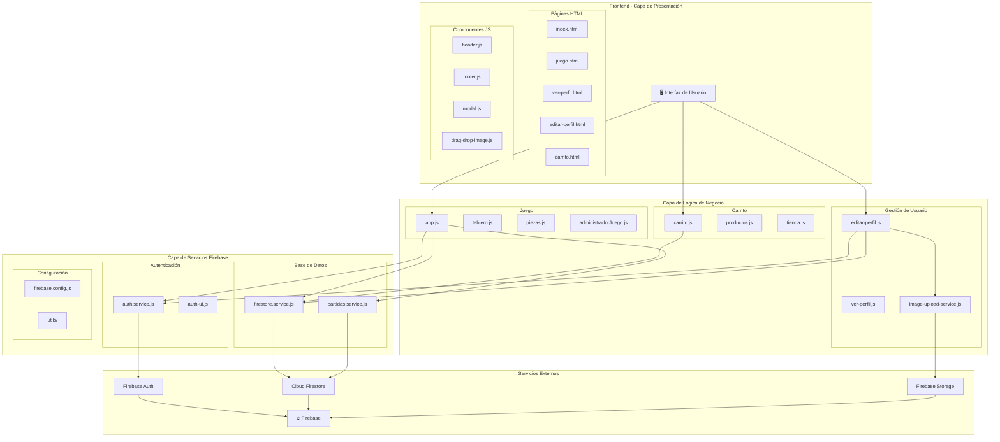
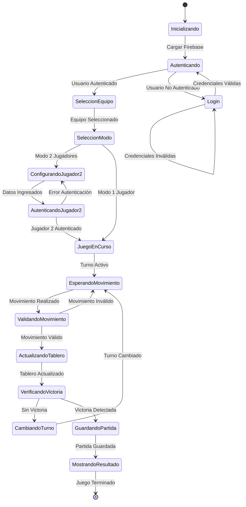
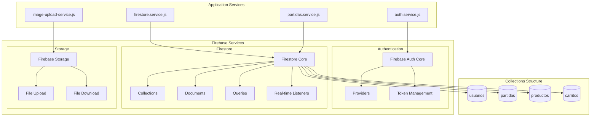
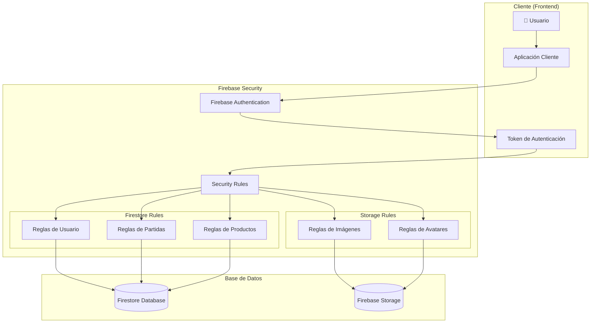
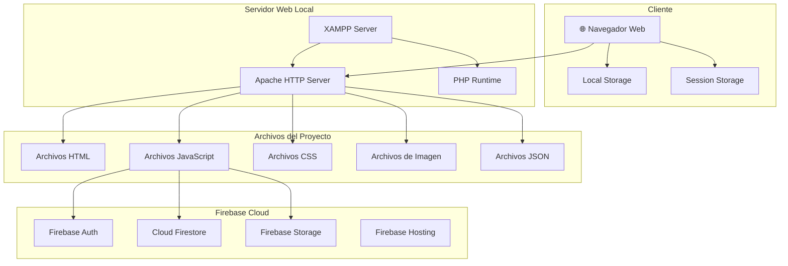

# Diagramas de Arquitectura del Sistema

## 1. Diagrama de Arquitectura General

## 2. Diagrama de Flujo de Datos del Juego

```mermaid
flowchart TD
    START([Inicio del Juego]) --> LOAD_CONFIG[Cargar Configuración Firebase]
    LOAD_CONFIG --> CHECK_AUTH{¿Usuario Autenticado?}
    
    CHECK_AUTH -->|No| LOGIN[Mostrar Login]
    CHECK_AUTH -->|Sí| SHOW_GAME[Mostrar Interfaz Juego]
    
    LOGIN --> AUTH_PROCESS[Proceso de Autenticación]
    AUTH_PROCESS --> FIREBASE_AUTH[Firebase Auth]
    FIREBASE_AUTH --> AUTH_SUCCESS{¿Autenticación Exitosa?}
    
    AUTH_SUCCESS -->|No| LOGIN
    AUTH_SUCCESS -->|Sí| SHOW_GAME
    
    SHOW_GAME --> SELECT_TEAM[Seleccionar Equipo]
    SELECT_TEAM --> SELECT_MODE[Seleccionar Modo]
    
    SELECT_MODE --> MODE_CHECK{¿Modo 2 Jugadores?}
    MODE_CHECK -->|No| START_GAME[Iniciar Juego]
    MODE_CHECK -->|Sí| PLAYER2_LOGIN[Login Jugador 2]
    
    PLAYER2_LOGIN --> PLAYER2_AUTH[Autenticar Jugador 2]
    PLAYER2_AUTH --> START_GAME
    
    START_GAME --> GAME_LOOP[Bucle de Juego]
    
    GAME_LOOP --> PLAYER_MOVE[Movimiento del Jugador]
    PLAYER_MOVE --> VALIDATE_MOVE[Validar Movimiento]
    VALIDATE_MOVE --> VALID_CHECK{¿Movimiento Válido?}
    
    VALID_CHECK -->|No| GAME_LOOP
    VALID_CHECK -->|Sí| UPDATE_BOARD[Actualizar Tablero]
    
    UPDATE_BOARD --> CHECK_WIN[Verificar Victoria]
    CHECK_WIN --> WIN_CHECK{¿Hay Ganador?}
    
    WIN_CHECK -->|No| CHANGE_TURN[Cambiar Turno]
    WIN_CHECK -->|Sí| SAVE_GAME[Guardar Partida]
    
    CHANGE_TURN --> GAME_LOOP
    
    SAVE_GAME --> FIRESTORE_SAVE[Guardar en Firestore]
    FIRESTORE_SAVE --> SHOW_RESULT[Mostrar Resultado]
    SHOW_RESULT --> END([Fin del Juego])
```

## 3. Diagrama de Estados del Juego

## 4. Diagrama de Componentes Firebase

## 5. Diagrama de Seguridad y Permisos

## 6. Diagrama de Despliegue

Estos diagramas proporcionan una visión completa de la arquitectura del sistema, mostrando cómo interactúan el juego y Firebase en diferentes niveles: desde la arquitectura general hasta los flujos específicos de datos y seguridad.