# Diagramas de Arquitectura del Sistema

## 1. Diagrama de Arquitectura General

```mermaid
graph TB
    %% Capa de Presentación
    subgraph "Frontend - Capa de Presentación"
        UI[🖥️ Interfaz de Usuario]
        subgraph "Páginas HTML"
            INDEX[index.html]
            JUEGO[juego.html]
            PERFIL[ver-perfil.html]
            EDITAR[editar-perfil.html]
            CARRITO[carrito.html]
        end
        
        subgraph "Componentes JS"
            HEADER[header.js]
            FOOTER[footer.js]
            MODAL[modal.js]
            DRAG[drag-drop-image.js]
        end
    end
    
    %% Capa de Lógica
    subgraph "Capa de Lógica de Negocio"
        subgraph "Juego"
            APP[app.js]
            TABLERO[tablero.js]
            PIEZAS[piezas.js]
            ADMIN[administradorJuego.js]
        end
        
        subgraph "Gestión de Usuario"
            PERFIL_JS[editar-perfil.js]
            VER_PERFIL[ver-perfil.js]
            IMG_SERVICE[image-upload-service.js]
        end
        
        subgraph "Carrito"
            CARRITO_JS[carrito.js]
            PRODUCTOS[productos.js]
            TIENDA[tienda.js]
        end
    end
    
    %% Capa de Servicios
    subgraph "Capa de Servicios Firebase"
        subgraph "Autenticación"
            AUTH_SERVICE[auth.service.js]
            AUTH_UI[auth-ui.js]
        end
        
        subgraph "Base de Datos"
            FIRESTORE[firestore.service.js]
            PARTIDAS[partidas.service.js]
        end
        
        subgraph "Configuración"
            CONFIG[firebase.config.js]
            UTILS[utils/]
        end
    end
    
    %% Servicios Externos
    subgraph "Servicios Externos"
        FIREBASE[🔥 Firebase]
        AUTH_FB[Firebase Auth]
        FIRESTORE_FB[Cloud Firestore]
        STORAGE_FB[Firebase Storage]
    end
    
    %% Conexiones
    UI --> APP
    UI --> PERFIL_JS
    UI --> CARRITO_JS
    
    APP --> AUTH_SERVICE
    APP --> FIRESTORE
    APP --> PARTIDAS
    
    PERFIL_JS --> AUTH_SERVICE
    PERFIL_JS --> FIRESTORE
    PERFIL_JS --> IMG_SERVICE
    
    CARRITO_JS --> FIRESTORE
    
    AUTH_SERVICE --> AUTH_FB
    FIRESTORE --> FIRESTORE_FB
    PARTIDAS --> FIRESTORE_FB
    IMG_SERVICE --> STORAGE_FB
    
    AUTH_FB --> FIREBASE
    FIRESTORE_FB --> FIREBASE
    STORAGE_FB --> FIREBASE
```

## 2. Diagrama de Flujo de Datos del Juego

```mermaid
flowchart TD
    START([Inicio del Juego]) --> LOAD_CONFIG[Cargar Configuración Firebase]
    LOAD_CONFIG --> CHECK_AUTH{¿Usuario Autenticado?}
    
    CHECK_AUTH -->|No| LOGIN[Mostrar Login]
    CHECK_AUTH -->|Sí| SHOW_GAME[Mostrar Interfaz Juego]
    
    LOGIN --> AUTH_PROCESS[Proceso de Autenticación]
    AUTH_PROCESS --> FIREBASE_AUTH[Firebase Auth]
    FIREBASE_AUTH --> AUTH_SUCCESS{¿Autenticación Exitosa?}
    
    AUTH_SUCCESS -->|No| LOGIN
    AUTH_SUCCESS -->|Sí| SHOW_GAME
    
    SHOW_GAME --> SELECT_TEAM[Seleccionar Equipo]
    SELECT_TEAM --> SELECT_MODE[Seleccionar Modo]
    
    SELECT_MODE --> MODE_CHECK{¿Modo 2 Jugadores?}
    MODE_CHECK -->|No| START_GAME[Iniciar Juego]
    MODE_CHECK -->|Sí| PLAYER2_LOGIN[Login Jugador 2]
    
    PLAYER2_LOGIN --> PLAYER2_AUTH[Autenticar Jugador 2]
    PLAYER2_AUTH --> START_GAME
    
    START_GAME --> GAME_LOOP[Bucle de Juego]
    
    GAME_LOOP --> PLAYER_MOVE[Movimiento del Jugador]
    PLAYER_MOVE --> VALIDATE_MOVE[Validar Movimiento]
    VALIDATE_MOVE --> VALID_CHECK{¿Movimiento Válido?}
    
    VALID_CHECK -->|No| GAME_LOOP
    VALID_CHECK -->|Sí| UPDATE_BOARD[Actualizar Tablero]
    
    UPDATE_BOARD --> CHECK_WIN[Verificar Victoria]
    CHECK_WIN --> WIN_CHECK{¿Hay Ganador?}
    
    WIN_CHECK -->|No| CHANGE_TURN[Cambiar Turno]
    WIN_CHECK -->|Sí| SAVE_GAME[Guardar Partida]
    
    CHANGE_TURN --> GAME_LOOP
    
    SAVE_GAME --> FIRESTORE_SAVE[Guardar en Firestore]
    FIRESTORE_SAVE --> SHOW_RESULT[Mostrar Resultado]
    SHOW_RESULT --> END([Fin del Juego])
```

## 3. Diagrama de Estados del Juego

```mermaid
stateDiagram-v2
    [*] --> Inicializando
    
    Inicializando --> Autenticando : Cargar Firebase
    Autenticando --> SeleccionEquipo : Usuario Autenticado
    Autenticando --> Login : Usuario No Autenticado
    
    Login --> Autenticando : Credenciales Válidas
    Login --> Login : Credenciales Inválidas
    
    SeleccionEquipo --> SeleccionModo : Equipo Seleccionado
    SeleccionModo --> ConfigurandoJugador2 : Modo 2 Jugadores
    SeleccionModo --> JuegoEnCurso : Modo 1 Jugador
    
    ConfigurandoJugador2 --> AutenticandoJugador2 : Datos Ingresados
    AutenticandoJugador2 --> JuegoEnCurso : Jugador 2 Autenticado
    AutenticandoJugador2 --> ConfigurandoJugador2 : Error Autenticación
    
    JuegoEnCurso --> EsperandoMovimiento : Turno Activo
    EsperandoMovimiento --> ValidandoMovimiento : Movimiento Realizado
    ValidandoMovimiento --> EsperandoMovimiento : Movimiento Inválido
    ValidandoMovimiento --> ActualizandoTablero : Movimiento Válido
    
    ActualizandoTablero --> VerificandoVictoria : Tablero Actualizado
    VerificandoVictoria --> CambiandoTurno : Sin Victoria
    VerificandoVictoria --> GuardandoPartida : Victoria Detectada
    
    CambiandoTurno --> EsperandoMovimiento : Turno Cambiado
    
    GuardandoPartida --> MostrandoResultado : Partida Guardada
    MostrandoResultado --> [*] : Juego Terminado
```

## 4. Diagrama de Componentes Firebase

## 5. Diagrama de Seguridad y Permisos

## 6. Diagrama de Despliegue

```mermaid
graph TB
    subgraph "Cliente"
        BROWSER[🌐 Navegador Web]
        LOCAL_STORAGE[Local Storage]
        SESSION_STORAGE[Session Storage]
    end
    
    subgraph "Servidor Web Local"
        XAMPP[XAMPP Server]
        APACHE[Apache HTTP Server]
        PHP[PHP Runtime]
    end
    
    subgraph "Firebase Cloud"
        FB_AUTH[Firebase Auth]
        FB_FIRESTORE[Cloud Firestore]
        FB_STORAGE[Firebase Storage]
        FB_HOSTING[Firebase Hosting]
    end
    
    subgraph "Archivos del Proyecto"
        HTML_FILES[Archivos HTML]
        JS_FILES[Archivos JavaScript]
        CSS_FILES[Archivos CSS]
        IMG_FILES[Archivos de Imagen]
        JSON_FILES[Archivos JSON]
    end
    
    %% Conexiones
    BROWSER --> APACHE
    APACHE --> HTML_FILES
    APACHE --> JS_FILES
    APACHE --> CSS_FILES
    APACHE --> IMG_FILES
    APACHE --> JSON_FILES
    
    BROWSER --> LOCAL_STORAGE
    BROWSER --> SESSION_STORAGE
    
    JS_FILES --> FB_AUTH
    JS_FILES --> FB_FIRESTORE
    JS_FILES --> FB_STORAGE
    
    XAMPP --> APACHE
    XAMPP --> PHP
```

Estos diagramas proporcionan una visión completa de la arquitectura del sistema, mostrando cómo interactúan el juego y Firebase en diferentes niveles: desde la arquitectura general hasta los flujos específicos de datos y seguridad.