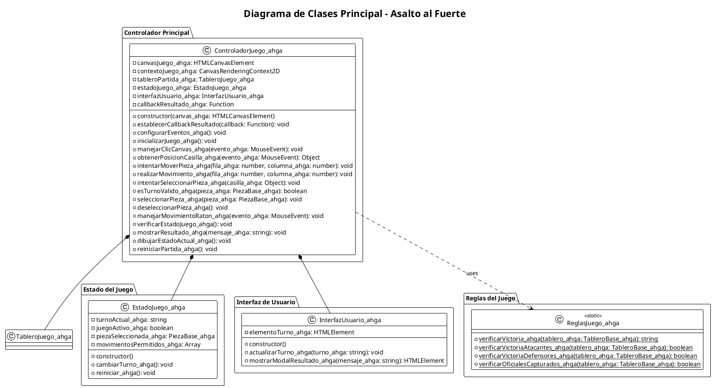
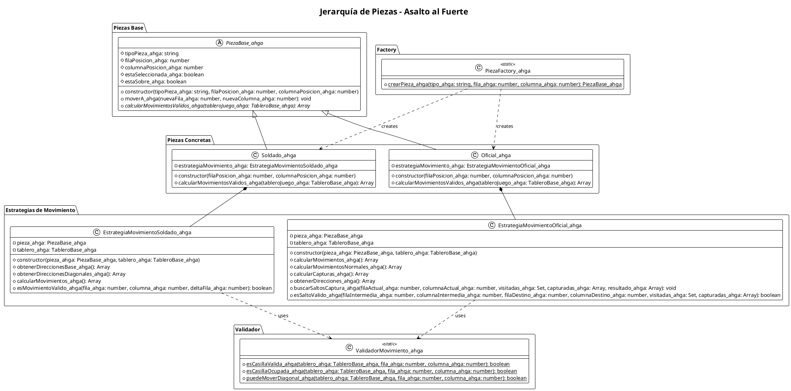
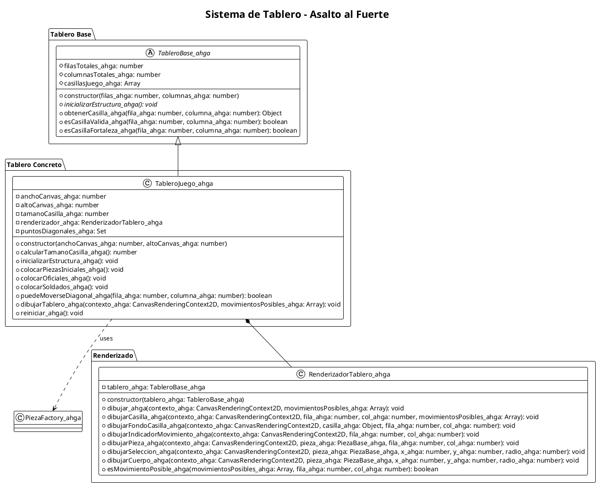
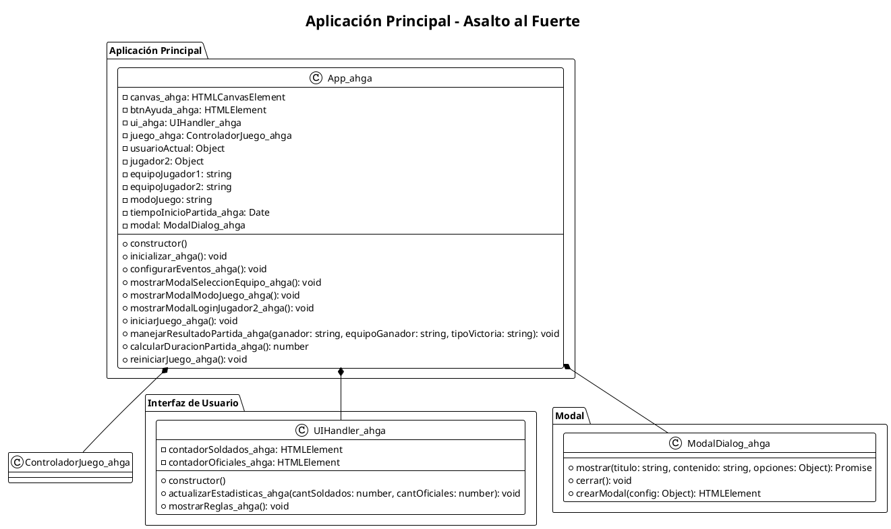
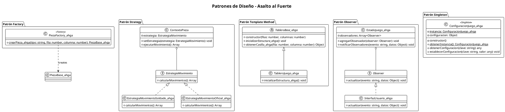
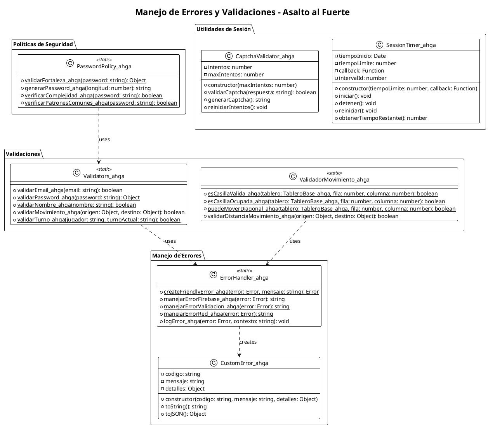

# Diagramas de Clases PlantUML - Juego Asalto al Fuerte

## 1. Diagrama de Clases Principal del Juego

## 2. Diagrama de Clases - Jerarquía de Piezas

## 3. Diagrama de Clases - Sistema de Tablero

## 4. Diagrama de Clases - Aplicación Principal

## 5. Diagrama de Clases - Servicios Firebase

```plantuml
@startuml
!theme plain
title Servicios Firebase - Asalto al Fuerte

package "Servicios de Autenticación" {
  class AuthService_ahga <<static>> {
    + {static} registrarUsuario_ahga(email_ahga: string, password_ahga: string, additionalData_ahga: Object): Promise
    + {static} verificarUsuarioActual_ahga(): Object
    + {static} validarCredenciales_ahga(email_ahga: string, password_ahga: string): Promise
    + {static} iniciarSesion_ahga(email_ahga: string, password_ahga: string): Promise
    + {static} cerrarSesion_ahga(): Promise
    + {static} cambiarPassword_ahga(passwordActual_ahga: string, passwordNuevo_ahga: string): Promise
    - {static} generarCodigoCupon_ahga(longitud_ahga: number): string
    - {static} crearCuponBienvenida_ahga(userId_ahga: string): Promise
  }
}

package "Servicios de Partidas" {
  class PartidasService_ahga <<static>> {
    + {static} guardarPartida_ahga(datosPartida_ahga: Object): Promise
    + {static} obtenerHistorialPartidas_ahga(jugadorId_ahga: string, limite_ahga: number): Promise
    + {static} obtenerEstadisticasJugador_ahga(jugadorId_ahga: string): Promise
    + {static} obtenerRankingJugadores_ahga(limite_ahga: number): Promise
    - {static} actualizarEstadisticasJugador_ahga(jugadorId_ahga: string, datosPartida_ahga: Object): Promise
  }
}

package "Servicios de Firestore" {
  class FirestoreService_ahga <<static>> {
    + {static} obtenerUsuario_ahga(userId_ahga: string): Promise
    + {static} actualizarUsuario_ahga(userId_ahga: string, datos_ahga: Object): Promise
    + {static} validarCredencialesFirestore_ahga(email_ahga: string, password_ahga: string): Promise
    + {static} obtenerDocumento_ahga(coleccion_ahga: string, documentoId_ahga: string): Promise
    + {static} guardarDocumento_ahga(coleccion_ahga: string, documentoId_ahga: string, datos_ahga: Object): Promise
  }
}

package "Utilidades" {
  class ErrorHandler_ahga <<static>> {
    + {static} createFriendlyError_ahga(error_ahga: Error, mensaje_ahga: string): Error
    + {static} manejarErrorFirebase_ahga(error_ahga: Error): string
  }
  
  class Validators_ahga <<static>> {
    + {static} validarEmail_ahga(email_ahga: string): boolean
    + {static} validarPassword_ahga(password_ahga: string): Object
    + {static} validarNombre_ahga(nombre_ahga: string): boolean
  }
}

AuthService_ahga ..> ErrorHandler_ahga : uses
PartidasService_ahga ..> ErrorHandler_ahga : uses
FirestoreService_ahga ..> ErrorHandler_ahga : uses

AuthService_ahga ..> Validators_ahga : uses

@enduml
```

## 6. Diagrama de Clases Completo - Vista General

```plantuml
@startuml
!theme plain
title Diagrama de Clases Completo - Asalto al Fuerte

package "Capa de Presentación" {
  class App_ahga {
    - canvas_ahga: HTMLCanvasElement
    - ui_ahga: UIHandler_ahga
    - juego_ahga: ControladorJuego_ahga
    - modal: ModalDialog_ahga
  }
  
  class UIHandler_ahga {
    + actualizarEstadisticas_ahga(): void
    + mostrarReglas_ahga(): void
  }
  
  class ModalDialog_ahga {
    + mostrar(): Promise
    + cerrar(): void
  }
}

package "Capa de Lógica de Juego" {
  class ControladorJuego_ahga {
    - tableroPartida_ahga: TableroJuego_ahga
    - estadoJuego_ahga: EstadoJuego_ahga
    - interfazUsuario_ahga: InterfazUsuario_ahga
  }
  
  class EstadoJuego_ahga {
    - turnoActual_ahga: string
    - juegoActivo_ahga: boolean
    - piezaSeleccionada_ahga: PiezaBase_ahga
  }
  
  class ReglasJuego_ahga <<static>> {
    + {static} verificarVictoria_ahga(): string
  }
}

package "Capa de Modelo" {
  abstract class PiezaBase_ahga {
    # tipoPieza_ahga: string
    # filaPosicion_ahga: number
    # columnaPosicion_ahga: number
  }
  
  class Soldado_ahga {
    - estrategiaMovimiento_ahga: EstrategiaMovimientoSoldado_ahga
  }
  
  class Oficial_ahga {
    - estrategiaMovimiento_ahga: EstrategiaMovimientoOficial_ahga
  }
  
  abstract class TableroBase_ahga {
    # casillasJuego_ahga: Array
  }
  
  class TableroJuego_ahga {
    - renderizador_ahga: RenderizadorTablero_ahga
  }
}

package "Capa de Servicios" {
  class AuthService_ahga <<static>> {
    + {static} iniciarSesion_ahga(): Promise
    + {static} registrarUsuario_ahga(): Promise
  }
  
  class PartidasService_ahga <<static>> {
    + {static} guardarPartida_ahga(): Promise
    + {static} obtenerEstadisticas_ahga(): Promise
  }
  
  class FirestoreService_ahga <<static>> {
    + {static} obtenerUsuario_ahga(): Promise
    + {static} actualizarUsuario_ahga(): Promise
  }
}

package "Capa de Estrategias" {
  class EstrategiaMovimientoSoldado_ahga {
    + calcularMovimientos_ahga(): Array
  }
  
  class EstrategiaMovimientoOficial_ahga {
    + calcularMovimientos_ahga(): Array
    + calcularCapturas_ahga(): Array
  }
}

package "Capa de Renderizado" {
  class RenderizadorTablero_ahga {
    + dibujar_ahga(): void
    + dibujarPieza_ahga(): void
  }
}

' Relaciones principales
App_ahga *-- UIHandler_ahga
App_ahga *-- ControladorJuego_ahga
App_ahga *-- ModalDialog_ahga

ControladorJuego_ahga *-- EstadoJuego_ahga
ControladorJuego_ahga *-- TableroJuego_ahga
ControladorJuego_ahga ..> ReglasJuego_ahga

PiezaBase_ahga <|-- Soldado_ahga
PiezaBase_ahga <|-- Oficial_ahga
TableroBase_ahga <|-- TableroJuego_ahga

Soldado_ahga *-- EstrategiaMovimientoSoldado_ahga
Oficial_ahga *-- EstrategiaMovimientoOficial_ahga
TableroJuego_ahga *-- RenderizadorTablero_ahga

App_ahga ..> AuthService_ahga
App_ahga ..> PartidasService_ahga
App_ahga ..> FirestoreService_ahga

@enduml
```

## 7. Diagrama de Clases - Patrones de Diseño

## 8. Diagrama de Clases - Manejo de Errores y Validaciones

