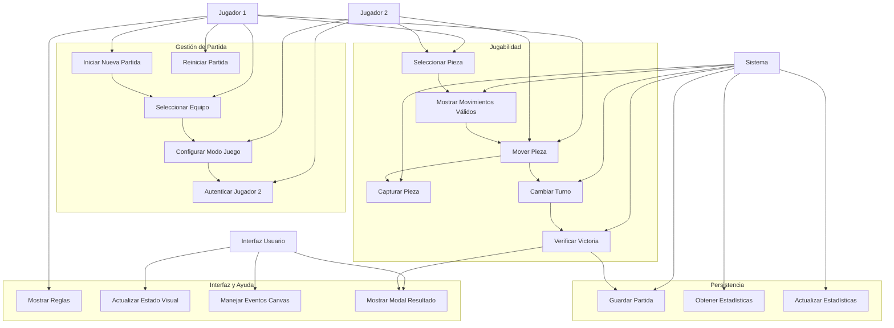
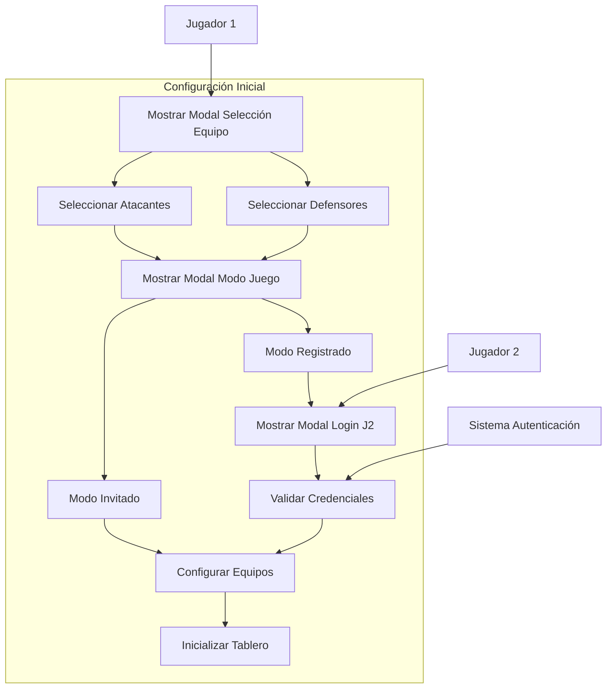
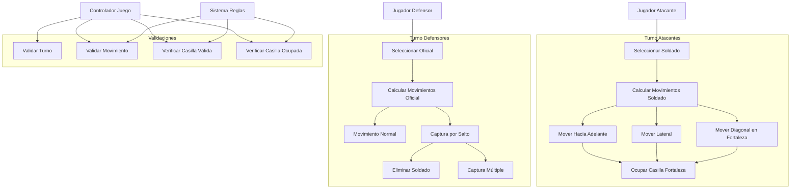
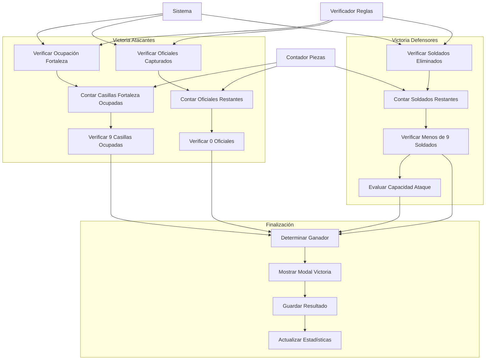
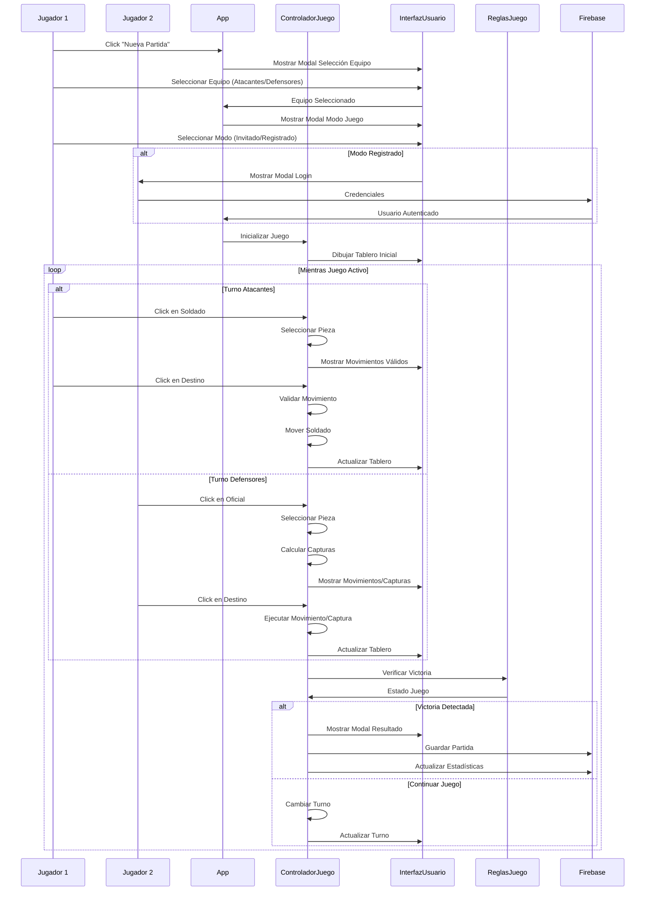
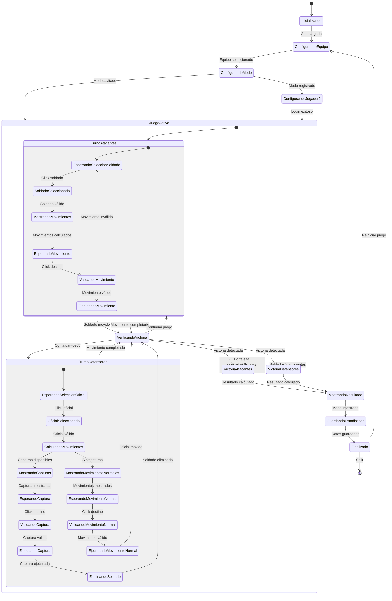
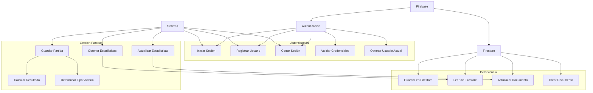

# Diagramas de Uso - Juego Asalto al Fuerte

## 1. Diagrama General de Casos de Uso del Juego

## 2. Diagrama de Casos de Uso - Configuración de Partida

## 3. Diagrama de Casos de Uso - Mecánicas de Juego

## 4. Diagrama de Casos de Uso - Condiciones de Victoria

## 5. Diagrama de Casos de Uso - Interfaz de Usuario

```mermaid
graph TB
    %% Actores
    USER[Usuario]
    CANVAS[Canvas]
    UI[Interfaz Usuario]
    MODAL[Sistema Modal]
    
    subgraph "Interacción Canvas"
        UC1[Manejar Click Canvas]
        UC2[Calcular Posición Casilla]
        UC3[Manejar Movimiento Ratón]
        UC4[Aplicar Hover Pieza]
        UC5[Resetear Hover]
    end
    
    subgraph "Visualización"
        UC6[Dibujar Estado Actual]
        UC7[Mostrar Piezas Seleccionadas]
        UC8[Mostrar Movimientos Válidos]
        UC9[Actualizar Turno Actual]
        UC10[Mostrar Información Jugadores]
    end
    
    subgraph "Modales"
        UC11[Mostrar Modal Reglas]
        UC12[Mostrar Modal Resultado]
        UC13[Mostrar Modal Selección]
        UC14[Mostrar Modal Login]
    end
    
    subgraph "Controles"
        UC15[Botón Nueva Partida]
        UC16[Botón Ayuda]
        UC17[Botón Regresar]
        UC18[Manejo Teclas]
    end
    
    %% Relaciones
    USER --> UC1
    USER --> UC3
    USER --> UC15
    USER --> UC16
    USER --> UC17
    USER --> UC18
    
    CANVAS --> UC1
    CANVAS --> UC2
    CANVAS --> UC3
    
    UC1 --> UC2
    UC3 --> UC4
    UC3 --> UC5
    
    UI --> UC6
    UI --> UC7
    UI --> UC8
    UI --> UC9
    UI --> UC10
    
    MODAL --> UC11
    MODAL --> UC12
    MODAL --> UC13
    MODAL --> UC14
    
    UC16 --> UC11
    UC15 --> UC13
```

## 6. Diagrama de Secuencia - Flujo Completo de Partida

## 7. Diagrama de Estados del Juego

## 8. Diagrama de Casos de Uso - Gestión de Datos

