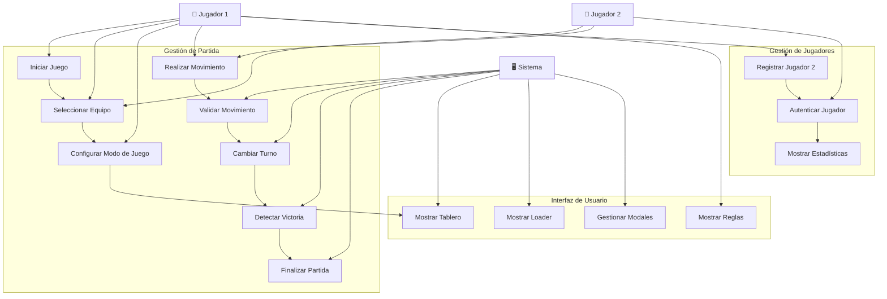
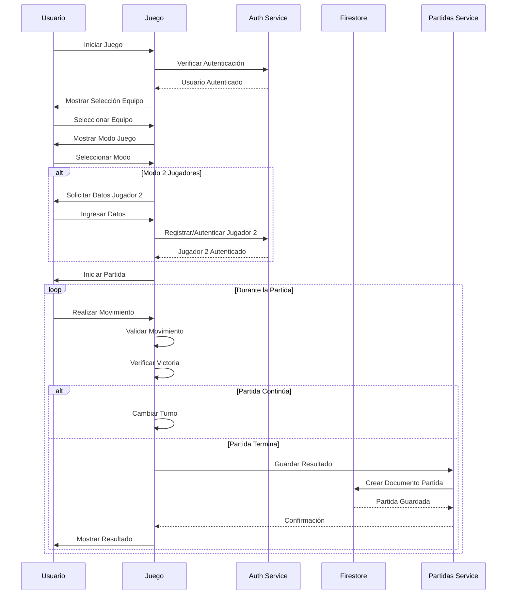

# Diagramas de Casos de Uso

## 1. Diagrama de Casos de Uso del Juego

### Descripción de Casos de Uso del Juego:

#### UC1: Iniciar Juego
- **Actor:** Jugador 1
- **Descripción:** El jugador inicia una nueva partida del juego
- **Precondiciones:** Ninguna
- **Postcondiciones:** Se muestra la interfaz de selección de equipo

#### UC2: Seleccionar Equipo
- **Actores:** Jugador 1, Jugador 2
- **Descripción:** Los jugadores seleccionan sus equipos (X u O)
- **Precondiciones:** El juego debe estar iniciado
- **Postcondiciones:** Los equipos están asignados

#### UC3: Configurar Modo de Juego
- **Actor:** Jugador 1
- **Descripción:** Selecciona entre modo un jugador o dos jugadores
- **Precondiciones:** Los equipos deben estar seleccionados
- **Postcondiciones:** El modo de juego está configurado

#### UC4: Realizar Movimiento
- **Actores:** Jugador 1, Jugador 2
- **Descripción:** El jugador hace clic en una casilla para colocar su pieza
- **Precondiciones:** Debe ser el turno del jugador
- **Postcondiciones:** La pieza se coloca en el tablero

#### UC5: Validar Movimiento
- **Actor:** Sistema
- **Descripción:** Verifica que el movimiento sea válido
- **Precondiciones:** Se ha realizado un movimiento
- **Postcondiciones:** El movimiento es aceptado o rechazado

#### UC6: Cambiar Turno
- **Actor:** Sistema
- **Descripción:** Alterna el turno entre jugadores
- **Precondiciones:** Se ha realizado un movimiento válido
- **Postcondiciones:** Es el turno del otro jugador

#### UC7: Detectar Victoria
- **Actor:** Sistema
- **Descripción:** Verifica si hay un ganador o empate
- **Precondiciones:** Se ha realizado un movimiento
- **Postcondiciones:** Se determina el estado del juego

#### UC8: Finalizar Partida
- **Actor:** Sistema
- **Descripción:** Termina la partida y registra el resultado
- **Precondiciones:** Hay un ganador o empate
- **Postcondiciones:** La partida está finalizada

---

## 2. Diagrama de Casos de Uso de Firebase

```mermaid
graph TB
    %% Actores
    U[👤 Usuario]
    A[👤 Administrador]
    S[🖥️ Sistema]
    FB[🔥 Firebase]
    
    %% Casos de uso de autenticación
    subgraph "Autenticación"
        UC20[Registrar Usuario]
        UC21[Iniciar Sesión]
        UC22[Cerrar Sesión]
        UC23[Recuperar Contraseña]
        UC24[Validar Sesión]
        UC25[Gestionar Tokens]
    end
    
    %% Casos de uso de Firestore
    subgraph "Base de Datos (Firestore)"
        UC26[Crear Documento]
        UC27[Leer Documento]
        UC28[Actualizar Documento]
        UC29[Eliminar Documento]
        UC30[Consultar Colección]
        UC31[Escuchar Cambios]
    end
    
    %% Casos de uso específicos del proyecto
    subgraph "Gestión de Datos"
        UC32[Guardar Partida]
        UC33[Cargar Historial]
        UC34[Actualizar Perfil]
        UC35[Subir Avatar]
        UC36[Gestionar Productos]
        UC37[Procesar Carrito]
    end
    
    %% Casos de uso de seguridad
    subgraph "Seguridad"
        UC38[Validar Permisos]
        UC39[Aplicar Reglas]
        UC40[Auditar Accesos]
        UC41[Manejar Errores]
    end
    
    %% Relaciones principales
    U --> UC20
    U --> UC21
    U --> UC22
    U --> UC23
    U --> UC32
    U --> UC33
    U --> UC34
    U --> UC35
    U --> UC37
    
    A --> UC36
    A --> UC40
    
    S --> UC24
    S --> UC25
    S --> UC26
    S --> UC27
    S --> UC28
    S --> UC29
    S --> UC30
    S --> UC31
    S --> UC38
    S --> UC39
    S --> UC41
    
    FB --> UC24
    FB --> UC25
    FB --> UC26
    FB --> UC27
    FB --> UC28
    FB --> UC29
    FB --> UC30
    FB --> UC31
    FB --> UC38
    FB --> UC39
    
    %% Dependencias
    UC20 --> UC24
    UC21 --> UC24
    UC32 --> UC26
    UC33 --> UC27
    UC34 --> UC28
    UC35 --> UC26
    UC36 --> UC26
    UC37 --> UC26
```

### Descripción de Casos de Uso de Firebase:

#### Autenticación

##### UC20: Registrar Usuario
- **Actor:** Usuario
- **Descripción:** Crear una nueva cuenta de usuario
- **Precondiciones:** Email válido y contraseña segura
- **Postcondiciones:** Usuario registrado en Firebase Auth

##### UC21: Iniciar Sesión
- **Actor:** Usuario
- **Descripción:** Autenticar usuario con email y contraseña
- **Precondiciones:** Usuario registrado
- **Postcondiciones:** Usuario autenticado con token válido

##### UC22: Cerrar Sesión
- **Actor:** Usuario
- **Descripción:** Terminar la sesión actual
- **Precondiciones:** Usuario autenticado
- **Postcondiciones:** Sesión terminada, token invalidado

##### UC23: Recuperar Contraseña
- **Actor:** Usuario
- **Descripción:** Solicitar restablecimiento de contraseña
- **Precondiciones:** Email registrado
- **Postcondiciones:** Email de recuperación enviado

#### Base de Datos (Firestore)

##### UC26: Crear Documento
- **Actor:** Sistema
- **Descripción:** Crear un nuevo documento en Firestore
- **Precondiciones:** Usuario autenticado, permisos válidos
- **Postcondiciones:** Documento creado en la colección

##### UC27: Leer Documento
- **Actor:** Sistema
- **Descripción:** Obtener datos de un documento
- **Precondiciones:** Documento existe, permisos de lectura
- **Postcondiciones:** Datos obtenidos

##### UC28: Actualizar Documento
- **Actor:** Sistema
- **Descripción:** Modificar un documento existente
- **Precondiciones:** Documento existe, permisos de escritura
- **Postcondiciones:** Documento actualizado

##### UC29: Eliminar Documento
- **Actor:** Sistema
- **Descripción:** Borrar un documento de Firestore
- **Precondiciones:** Documento existe, permisos de eliminación
- **Postcondiciones:** Documento eliminado

#### Gestión de Datos Específicos

##### UC32: Guardar Partida
- **Actor:** Usuario
- **Descripción:** Registrar el resultado de una partida
- **Precondiciones:** Partida finalizada, usuario autenticado
- **Postcondiciones:** Resultado guardado en Firestore

##### UC33: Cargar Historial
- **Actor:** Usuario
- **Descripción:** Obtener historial de partidas del usuario
- **Precondiciones:** Usuario autenticado
- **Postcondiciones:** Historial mostrado

##### UC34: Actualizar Perfil
- **Actor:** Usuario
- **Descripción:** Modificar datos del perfil de usuario
- **Precondiciones:** Usuario autenticado
- **Postcondiciones:** Perfil actualizado

##### UC35: Subir Avatar
- **Actor:** Usuario
- **Descripción:** Cargar imagen de avatar del usuario
- **Precondiciones:** Usuario autenticado, imagen válida
- **Postcondiciones:** Avatar actualizado

---

## 3. Diagrama de Interacción Juego-Firebase

---

## 4. Casos de Uso por Módulo

### Módulo de Autenticación (auth.service.js)
- Registro de usuarios
- Inicio de sesión
- Cierre de sesión
- Recuperación de contraseña
- Validación de sesiones
- Gestión de tokens

### Módulo de Firestore (firestore.service.js)
- Operaciones CRUD en documentos
- Consultas a colecciones
- Listeners en tiempo real
- Manejo de transacciones

### Módulo de Partidas (partidas.service.js)
- Guardar resultados de partidas
- Consultar historial de partidas
- Estadísticas de usuario
- Ranking de jugadores

### Módulo de Interfaz de Usuario (auth-ui.js)
- Formularios de autenticación
- Validación de campos
- Manejo de errores
- Feedback visual

### Módulo del Juego (app.js)
- Lógica del juego
- Gestión de turnos
- Validación de movimientos
- Detección de victoria
- Integración con Firebase