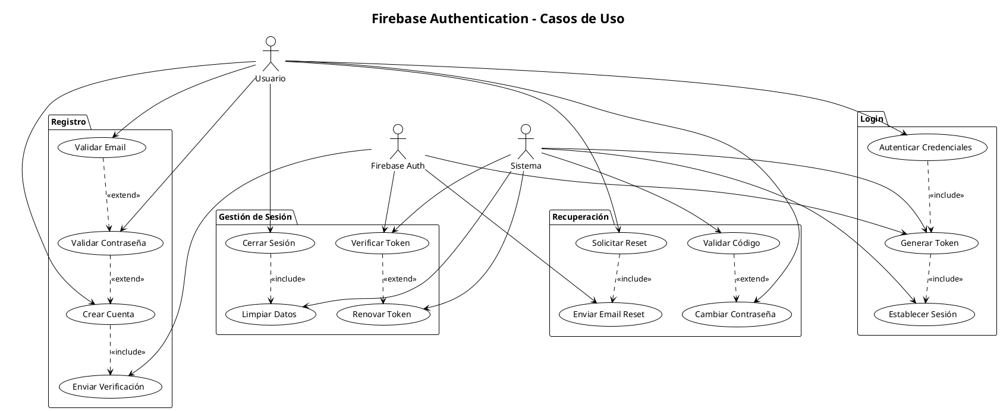
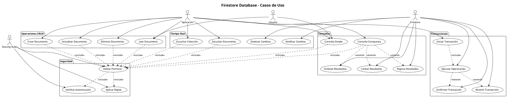
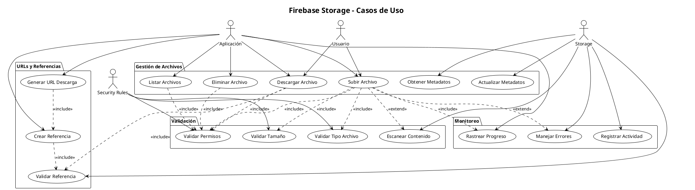
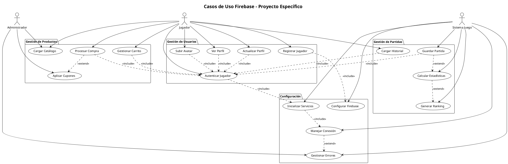
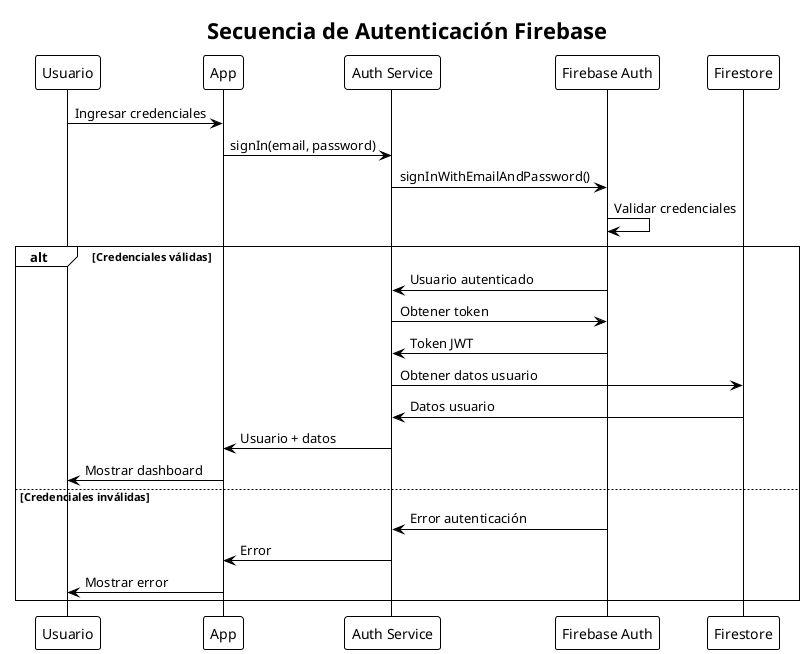
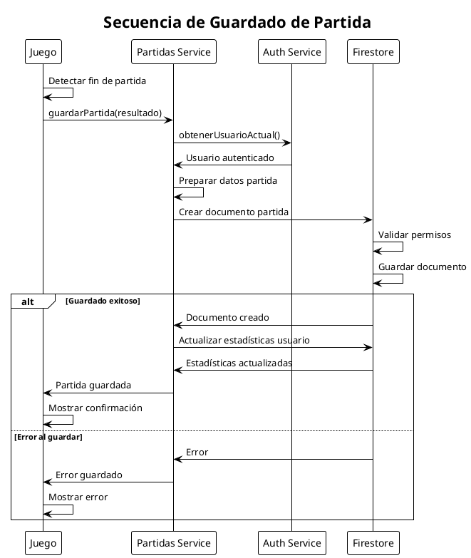

# Diagramas de Casos de Uso Firebase - PlantUML

## 1. Diagrama General de Casos de Uso Firebase

```plantuml
@startuml Firebase_Use_Cases
!theme plain
title Casos de Uso - Firebase Services

' Actores
actor "Usuario" as User
actor "Administrador" as Admin
actor "Sistema" as System
actor "Firebase" as Firebase

' Paquetes de casos de uso
package "Autenticación" {
  usecase "Registrar Usuario" as UC1
  usecase "Iniciar Sesión" as UC2
  usecase "Cerrar Sesión" as UC3
  usecase "Recuperar Contraseña" as UC4
  usecase "Validar Token" as UC5
  usecase "Renovar Sesión" as UC6
}

package "Gestión de Datos" {
  usecase "Crear Documento" as UC7
  usecase "Leer Documento" as UC8
  usecase "Actualizar Documento" as UC9
  usecase "Eliminar Documento" as UC10
  usecase "Consultar Colección" as UC11
  usecase "Escuchar Cambios" as UC12
}

package "Gestión de Archivos" {
  usecase "Subir Archivo" as UC13
  usecase "Descargar Archivo" as UC14
  usecase "Eliminar Archivo" as UC15
  usecase "Obtener URL" as UC16
}

package "Seguridad" {
  usecase "Aplicar Reglas" as UC17
  usecase "Validar Permisos" as UC18
  usecase "Auditar Accesos" as UC19
  usecase "Manejar Errores" as UC20
}

' Relaciones Usuario
User --> UC1
User --> UC2
User --> UC3
User --> UC4
User --> UC13
User --> UC14

' Relaciones Administrador
Admin --> UC7
Admin --> UC8
Admin --> UC9
Admin --> UC10
Admin --> UC11
Admin --> UC15
Admin --> UC19

' Relaciones Sistema
System --> UC5
System --> UC6
System --> UC12
System --> UC16
System --> UC17
System --> UC18
System --> UC20

' Relaciones Firebase
Firebase --> UC5
Firebase --> UC17
Firebase --> UC18
Firebase --> UC20

' Dependencias
UC1 ..> UC5 : <<include>>
UC2 ..> UC5 : <<include>>
UC7 ..> UC18 : <<include>>
UC8 ..> UC18 : <<include>>
UC9 ..> UC18 : <<include>>
UC10 ..> UC18 : <<include>>
UC13 ..> UC18 : <<include>>
UC14 ..> UC18 : <<include>>
UC15 ..> UC18 : <<include>>

@enduml
```

## 2. Diagrama de Autenticación Firebase

## 3. Diagrama de Firestore Database

## 4. Diagrama de Firebase Storage

## 5. Diagrama de Casos de Uso Específicos del Proyecto

## 6. Diagrama de Secuencia - Autenticación

## 7. Diagrama de Secuencia - Guardar Partida

Estos diagramas PlantUML proporcionan una documentación técnica completa y profesional de todos los casos de uso relacionados con Firebase en el proyecto, incluyendo autenticación, base de datos, almacenamiento y funcionalidades específicas del juego.