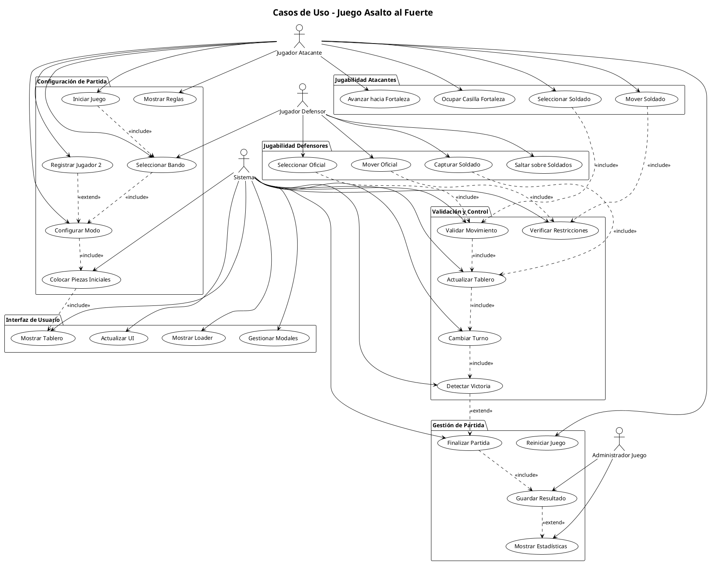
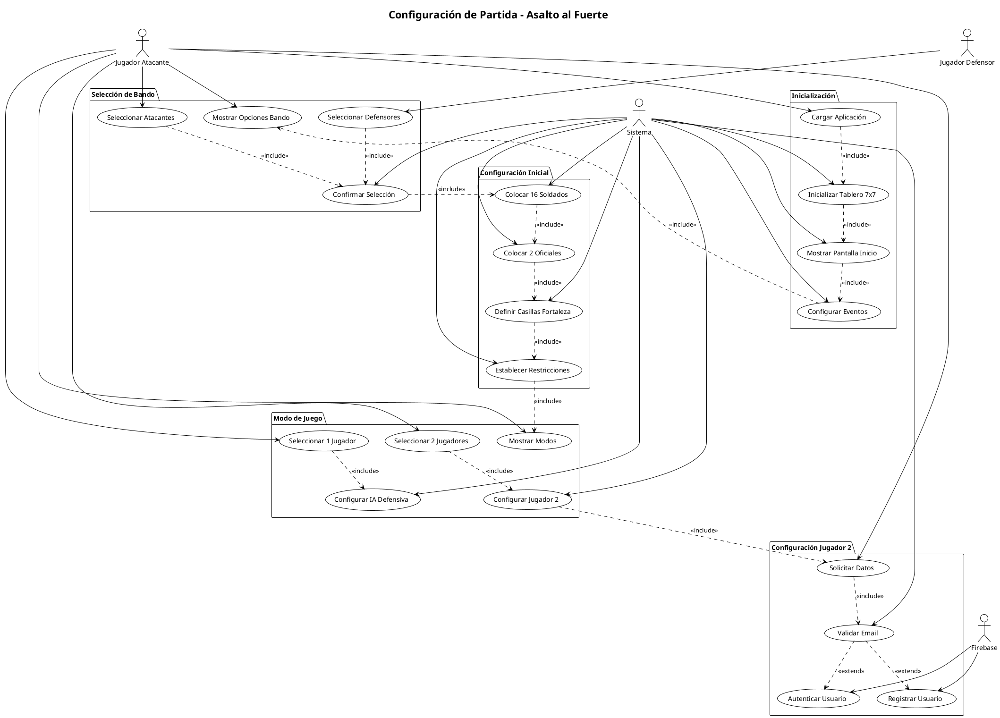
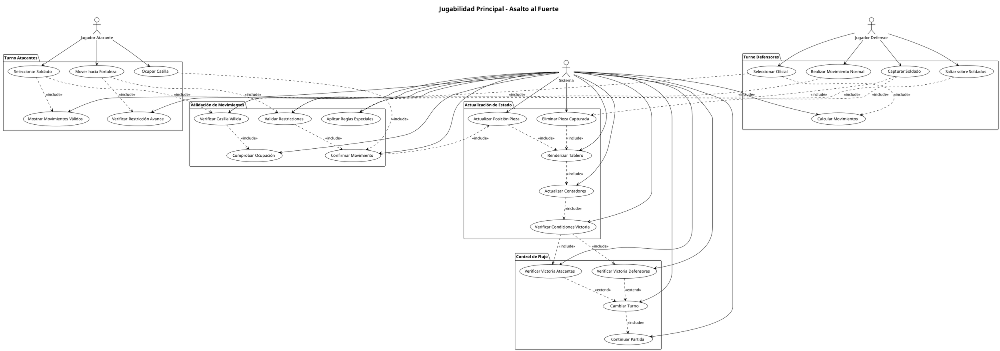
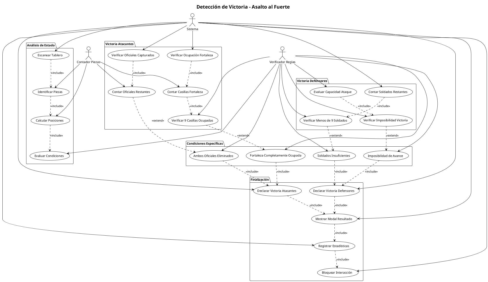
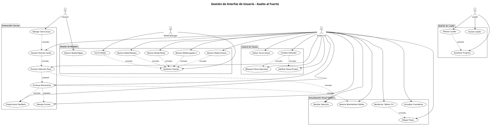
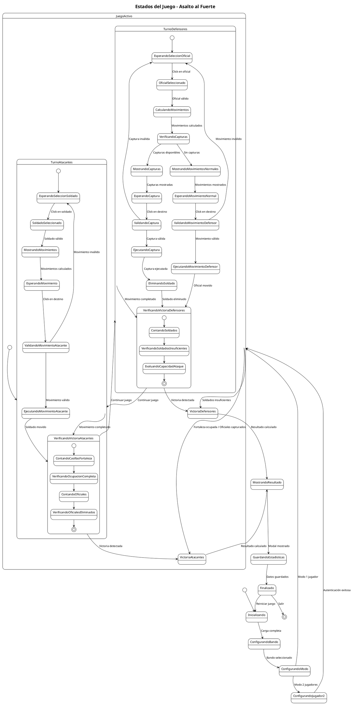

# Diagramas de Casos de Uso del Juego Asalto al Fuerte - PlantUML

## 1. Diagrama General de Casos de Uso del Juego

## 2. Diagrama de Configuración de Partida

## 3. Diagrama de Jugabilidad Principal

## 4. Diagrama de Detección de Victoria

## 5. Diagrama de Gestión de Interfaz

## 6. Diagrama de Secuencia - Flujo Completo de Partida

```plantuml
@startuml Complete_Game_Flow
!theme plain
title Flujo Completo de Partida - Asalto al Fuerte

participant "Jugador Atacante" as JA
participant "Jugador Defensor" as JD
participant "Interfaz" as UI
participant "Controlador" as CTRL
participant "Tablero" as BOARD
participant "Validador" as VAL
participant "Reglas" as RULES
participant "Firebase" as FB

JA -> UI: Iniciar juego
UI -> CTRL: Cargar aplicación
CTRL -> BOARD: Inicializar tablero 7x7
CTRL -> BOARD: Colocar 16 soldados
CTRL -> BOARD: Colocar 2 oficiales
CTRL -> BOARD: Definir casillas fortaleza
CTRL -> UI: Mostrar loader
UI -> JA: Mostrar modal bandos
JA -> UI: Seleccionar atacantes
UI -> CTRL: Confirmar selección
CTRL -> UI: Mostrar modal modo
JA -> UI: Seleccionar modo (1/2 jugadores)

alt Modo 2 jugadores
    UI -> JD: Mostrar login
    JD -> FB: Autenticar
    FB -> UI: Confirmar autenticación
    UI -> JD: Asignar defensores
else Modo 1 jugador
    CTRL -> CTRL: Configurar IA defensiva
end

CTRL -> UI: Ocultar loader
UI -> JA: Mostrar tablero con piezas
UI -> JA: Indicar turno atacantes

loop Mientras juego activo
    alt Turno Atacantes
        JA -> UI: Click en soldado
        UI -> CTRL: Seleccionar soldado
        CTRL -> VAL: Validar selección
        VAL -> CTRL: Soldado válido
        CTRL -> UI: Resaltar soldado
        CTRL -> VAL: Calcular movimientos válidos
        VAL -> RULES: Aplicar restricciones avance
        RULES -> VAL: Movimientos permitidos
        VAL -> UI: Mostrar indicadores
        
        JA -> UI: Click en casilla destino
        UI -> CTRL: Procesar movimiento
        CTRL -> VAL: Validar movimiento
        VAL -> BOARD: Verificar casilla libre
        VAL -> RULES: Verificar restricciones
        RULES -> VAL: Movimiento válido
        VAL -> CTRL: Confirmar movimiento
        CTRL -> BOARD: Mover soldado
        BOARD -> UI: Actualizar renderizado
        CTRL -> RULES: Verificar victoria atacantes
        
        alt Victoria atacantes (fortaleza ocupada)
            RULES -> CTRL: Victoria por ocupación
            CTRL -> UI: Mostrar modal victoria
            CTRL -> FB: Guardar estadísticas
            break
        else Victoria atacantes (oficiales capturados)
            RULES -> CTRL: Victoria por captura
            CTRL -> UI: Mostrar modal victoria
            CTRL -> FB: Guardar estadísticas
            break
        else Continuar
            CTRL -> CTRL: Cambiar turno a defensores
            UI -> JD: Indicar turno defensores
        end
        
    else Turno Defensores
        alt Jugador Defensor
            JD -> UI: Click en oficial
        else IA Defensiva
            CTRL -> CTRL: Calcular movimiento IA
        end
        
        UI -> CTRL: Seleccionar oficial
        CTRL -> VAL: Validar selección
        VAL -> CTRL: Oficial válido
        CTRL -> UI: Resaltar oficial
        CTRL -> VAL: Calcular movimientos/capturas
        VAL -> RULES: Verificar capturas disponibles
        
        alt Capturas disponibles
            RULES -> VAL: Movimientos de captura
            VAL -> UI: Mostrar capturas obligatorias
        else Sin capturas
            RULES -> VAL: Movimientos normales
            VAL -> UI: Mostrar movimientos
        end
        
        alt Jugador Defensor
            JD -> UI: Click en casilla destino
        else IA
            CTRL -> UI: Ejecutar movimiento IA
        end
        
        UI -> CTRL: Procesar movimiento
        CTRL -> VAL: Validar movimiento
        VAL -> RULES: Aplicar reglas captura
        
        alt Movimiento con captura
            RULES -> BOARD: Eliminar soldado capturado
            BOARD -> CTRL: Soldado eliminado
            CTRL -> UI: Actualizar contadores
        end
        
        RULES -> BOARD: Mover oficial
        BOARD -> UI: Actualizar renderizado
        CTRL -> RULES: Verificar victoria defensores
        
        alt Victoria defensores (soldados insuficientes)
            RULES -> CTRL: Victoria por eliminación
            CTRL -> UI: Mostrar modal victoria
            CTRL -> FB: Guardar estadísticas
            break
        else Continuar
            CTRL -> CTRL: Cambiar turno a atacantes
            UI -> JA: Indicar turno atacantes
        end
    end
end

JA -> UI: Reiniciar juego (opcional)
UI -> CTRL: Nueva partida
CTRL -> BOARD: Reinicializar tablero
CTRL -> BOARD: Recolocar piezas iniciales
CTRL -> CTRL: Reiniciar estado

@enduml
```

## 7. Diagrama de Estados del Juego

Estos diagramas PlantUML proporcionan una documentación completa y profesional de todos los aspectos del juego, desde la configuración inicial hasta la finalización de la partida, incluyendo la gestión de la interfaz de usuario y los diferentes estados del sistema.